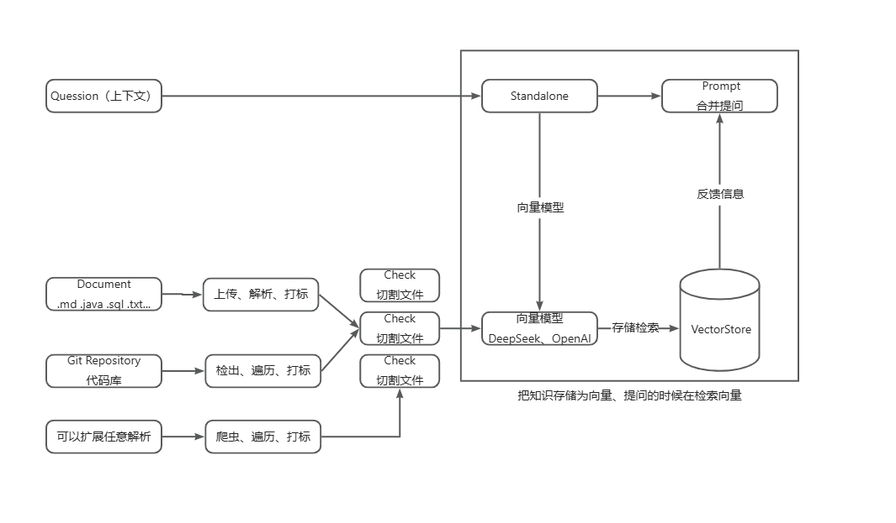
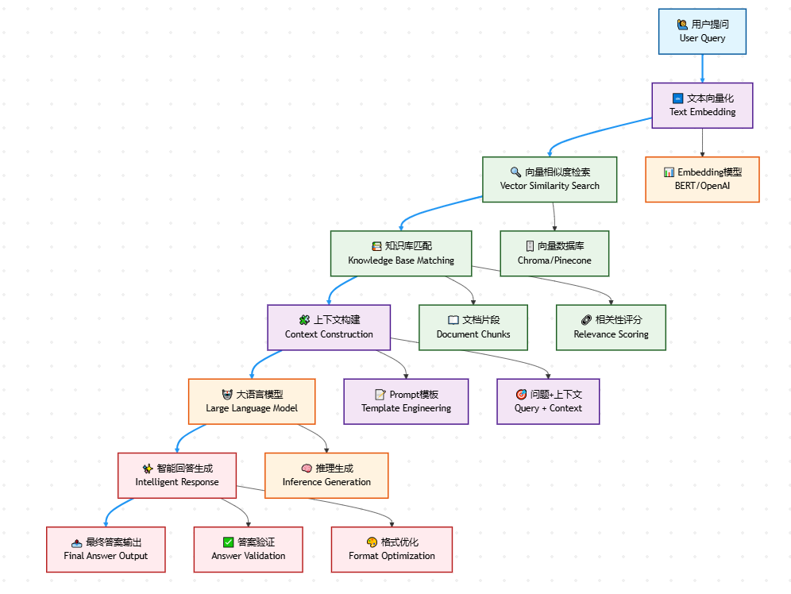

# 🚀 AI Knowledge Base Retrieval System

<div class="language-switcher">
  <button onclick="switchLanguage('en')" id="btn-en" class="active">English</button>
  <button onclick="switchLanguage('zh')" id="btn-zh">中文版</button>
</div>

<div id="content-en" class="language-content">

> An enhanced RAG (Retrieval-Augmented Generation) intelligent knowledge base system built on Spring AI framework with Ollama and OpenAI integration

## 📖 Project Overview

This project is an intelligent knowledge base system that integrates Retrieval-Augmented Generation (RAG) technology, designed to provide comprehensive AI-assisted solutions for enterprises. By combining the capabilities of multiple large language models, it achieves end-to-end intelligent processing from document parsing to intelligent Q&A.

## ✨ Core Features

### 🔍 RAG (Retrieval-Augmented Generation)

**Key Capabilities:**
- 📄 **Multi-format Document Processing**: Support for PDF, Word, Markdown, and other document formats via Apache Tika
- 🔗 **Git Repository Integration**: Automatic repository cloning and code analysis using JGit
- 🧠 **Dual Embedding Models**: 
  - Local `nomic-embed-text` model via Ollama for privacy and cost control
  - OpenAI `text-embedding-ada-002` for high-quality embeddings
- 🗄️ **Vector Storage**: PostgreSQL with pgvector extension for persistent vector storage
- 🔄 **Flexible Model Switching**: Configuration-based switching between local and cloud models

**Technical Benefits:**
- Enhanced search accuracy through semantic understanding
- Cost-effective hybrid model approach
- Scalable vector storage solution
- Privacy-preserving local processing option

### 🤖 AI-Powered Q&A System

**Core Workflow:**
1. **Document Ingestion**: Parse and chunk documents using Spring AI Tika integration
2. **Vector Embedding**: Convert text to vectors using selected embedding model
3. **Semantic Search**: Retrieve relevant documents from vector database
4. **Answer Generation**: Generate contextual responses using OpenAI GPT models

**Application Scenarios:**
- Enterprise knowledge management
- Technical documentation Q&A
- Code repository analysis and search
- Intelligent customer support

## 🏗️ Technical Architecture

### Supported AI Models
- **Ollama Models**: Local deployment with `nomic-embed-text` for embedding
- **OpenAI GPT Series**: Cloud-based models for text generation and embedding
- **Extensible Framework**: Easy integration of additional model providers

### Core Technology Stack
- **Backend Framework**: Spring Boot 3.2.3 with Spring AI
- **Vector Database**: PostgreSQL with pgvector extension
- **Caching**: Redis for performance optimization
- **Document Processing**: Apache Tika for multi-format support
- **API Documentation**: Swagger UI with Knife4j enhancements
- **Containerization**: Docker support for easy deployment

### Key Dependencies
- Spring AI BOM for AI model integration
- Redisson for Redis operations
- JGit for Git repository handling
- FastJSON for JSON processing
- HikariCP for database connection pooling

## 🚀 Quick Start

### Prerequisites
- Java 17+
- PostgreSQL with pgvector extension
- Redis server
- Ollama (for local models)
- OpenAI API key (for cloud models)

### Configuration

1. **Database Setup**: Configure PostgreSQL connection in `application-dev.yml`
2. **AI Models**: Set up Ollama locally or configure OpenAI API credentials
3. **Vector Storage**: Choose between SimpleVectorStore (memory) or PgVectorStore (persistent)
4. **Embedding Model**: Configure `spring.ai.rag.embed` to select embedding model

### Running the Application

```bash
# Clone the repository
git clone <repository-url>

# Navigate to the project directory
cd ai-knowledge

# Run with Maven
mvn spring-boot:run -pl dev-tech-app
```

The application will start on port 8090 with Swagger UI available at `/swagger-ui.html`.

## 📊 System Architecture



## 📊 RAG Workflow



## 🔧 Configuration Options

### Embedding Model Selection
- **Local Model**: Set `spring.ai.rag.embed=nomic-embed-text` for privacy and cost savings
- **Cloud Model**: Set `spring.ai.rag.embed=text-embedding-ada-002` for higher quality

### Vector Storage Options
- **Memory Storage**: `SimpleVectorStore` for development and testing
- **Persistent Storage**: `PgVectorStore` for production environments

## 🤝 Contributing

We welcome contributions! Please feel free to submit issues and pull requests.

## 📄 License

This project is licensed under the MIT License - see the LICENSE file for details.

</div>

<div id="content-zh" class="language-content" style="display: none;">

> 基于 Spring AI 框架构建的增强型 RAG（检索增强生成）智能知识库系统，集成 Ollama 和 OpenAI 模型

## 📖 项目简介

本项目是一个集成了检索增强生成（RAG）技术的智能知识库系统，旨在为企业提供全方位的AI辅助解决方案。通过结合多种大语言模型的能力，实现了从文档解析到智能问答的端到端智能化处理。

## ✨ 核心特性

### 🔍 RAG（检索增强生成）

**功能亮点：**
- 📄 **多格式文档处理**：通过 Apache Tika 支持 PDF、Word、Markdown 等多种文档格式
- 🔗 **Git代码库集成**：使用 JGit 自动拉取和解析代码仓库
- 🧠 **双重嵌入模型**：
  - 本地 `nomic-embed-text` 模型（通过 Ollama）保护隐私并控制成本
  - OpenAI `text-embedding-ada-002` 提供高质量嵌入
- 🗄️ **向量存储**：PostgreSQL 配合 pgvector 扩展实现持久化向量存储
- 🔄 **灵活模型切换**：基于配置的本地和云端模型切换

**技术优势：**
- 通过语义理解提升搜索准确性
- 成本效益的混合模型方案
- 可扩展的向量存储解决方案
- 隐私保护的本地处理选项

### 🤖 AI驱动的问答系统

**核心工作流程：**
1. **文档摄取**：使用 Spring AI Tika 集成解析和分块文档
2. **向量嵌入**：使用选定的嵌入模型将文本转换为向量
3. **语义搜索**：从向量数据库检索相关文档
4. **答案生成**：使用 OpenAI GPT 模型生成上下文相关的回答

**应用场景：**
- 企业知识管理
- 技术文档问答
- 代码仓库分析和搜索
- 智能客户支持

## 🏗️ 技术架构

### 支持的AI模型
- **Ollama 模型**：本地部署，使用 `nomic-embed-text` 进行嵌入
- **OpenAI GPT 系列**：云端模型用于文本生成和嵌入
- **可扩展框架**：轻松集成其他模型提供商

### 核心技术栈
- **后端框架**：Spring Boot 3.2.3 配合 Spring AI
- **向量数据库**：PostgreSQL 配合 pgvector 扩展
- **缓存**：Redis 用于性能优化
- **文档处理**：Apache Tika 支持多格式
- **API文档**：Swagger UI 配合 Knife4j 增强
- **容器化**：Docker 支持便于部署

### 关键依赖
- Spring AI BOM 用于AI模型集成
- Redisson 用于 Redis 操作
- JGit 用于 Git 仓库处理
- FastJSON 用于 JSON 处理
- HikariCP 用于数据库连接池

## 🚀 快速开始

### 前置要求
- Java 17+
- PostgreSQL 配合 pgvector 扩展
- Redis 服务器
- Ollama（用于本地模型）
- OpenAI API 密钥（用于云端模型）

### 配置

1. **数据库设置**：在 `application-dev.yml` 中配置 PostgreSQL 连接
2. **AI模型**：本地设置 Ollama 或配置 OpenAI API 凭据
3. **向量存储**：选择 SimpleVectorStore（内存）或 PgVectorStore（持久化）
4. **嵌入模型**：配置 `spring.ai.rag.embed` 选择嵌入模型

### 运行应用

```bash
# 克隆仓库
git clone <repository-url>

# 进入项目目录
cd ai-knowledge

# 使用 Maven 运行
mvn spring-boot:run -pl dev-tech-app
```

应用将在 8090 端口启动，Swagger UI 可通过 `/swagger-ui.html` 访问。

## 📊 系统架构图


## 📊 RAG流程图


## 🔧 配置选项

### 嵌入模型选择
- **本地模型**：设置 `spring.ai.rag.embed=nomic-embed-text` 保护隐私并节省成本
- **云端模型**：设置 `spring.ai.rag.embed=text-embedding-ada-002` 获得更高质量

### 向量存储选项
- **内存存储**：`SimpleVectorStore` 用于开发和测试
- **持久化存储**：`PgVectorStore` 用于生产环境

## 🤝 贡献

我们欢迎贡献！请随时提交问题和拉取请求。

## 📄 许可证

本项目采用 MIT 许可证 - 详情请参阅 LICENSE 文件。

</div>

<style>
.language-switcher {
  margin-bottom: 20px;
  text-align: center;
}

.language-switcher button {
  background: #f1f3f4;
  border: 1px solid #dadce0;
  border-radius: 4px;
  color: #3c4043;
  cursor: pointer;
  font-size: 14px;
  margin: 0 4px;
  padding: 8px 16px;
  transition: all 0.2s;
}

.language-switcher button:hover {
  background: #e8eaed;
}

.language-switcher button.active {
  background: #1a73e8;
  color: white;
  border-color: #1a73e8;
}

.language-content {
  animation: fadeIn 0.3s ease-in;
}

@keyframes fadeIn {
  from { opacity: 0; }
  to { opacity: 1; }
}
</style>

<script>
function switchLanguage(lang) {
  // Hide all content
  document.getElementById('content-en').style.display = 'none';
  document.getElementById('content-zh').style.display = 'none';
  
  // Remove active class from all buttons
  document.getElementById('btn-en').classList.remove('active');
  document.getElementById('btn-zh').classList.remove('active');
  
  // Show selected content and activate button
  if (lang === 'en') {
    document.getElementById('content-en').style.display = 'block';
    document.getElementById('btn-en').classList.add('active');
  } else {
    document.getElementById('content-zh').style.display = 'block';
    document.getElementById('btn-zh').classList.add('active');
  }
  
  // Save preference
  localStorage.setItem('preferred-language', lang);
}

// Load saved preference on page load
document.addEventListener('DOMContentLoaded', function() {
  const savedLang = localStorage.getItem('preferred-language') || 'en';
  switchLanguage(savedLang);
});
</script>

## 📖 Project Overview

This project is an intelligent knowledge base system that integrates Retrieval-Augmented Generation (RAG) technology, designed to provide comprehensive AI-assisted solutions for enterprises. By combining the capabilities of multiple large language models, it achieves end-to-end intelligent processing from document parsing to intelligent Q&A.

## ✨ Core Features

### 🔍 RAG (Retrieval-Augmented Generation)

**Key Capabilities:**
- 📄 **Multi-format Document Processing**: Support for PDF, Word, Markdown, and other document formats via Apache Tika
- 🔗 **Git Repository Integration**: Automatic repository cloning and code analysis using JGit
- 🧠 **Dual Embedding Models**: 
  - Local `nomic-embed-text` model via Ollama for privacy and cost control
  - OpenAI `text-embedding-ada-002` for high-quality embeddings
- 🗄️ **Vector Storage**: PostgreSQL with pgvector extension for persistent vector storage
- 🔄 **Flexible Model Switching**: Configuration-based switching between local and cloud models

**Technical Benefits:**
- Enhanced search accuracy through semantic understanding
- Cost-effective hybrid model approach
- Scalable vector storage solution
- Privacy-preserving local processing option

### 🤖 AI-Powered Q&A System

**Core Workflow:**
1. **Document Ingestion**: Parse and chunk documents using Spring AI Tika integration
2. **Vector Embedding**: Convert text to vectors using selected embedding model
3. **Semantic Search**: Retrieve relevant documents from vector database
4. **Answer Generation**: Generate contextual responses using OpenAI GPT models

**Application Scenarios:**
- Enterprise knowledge management
- Technical documentation Q&A
- Code repository analysis and search
- Intelligent customer support

## 🏗️ Technical Architecture

### Supported AI Models
- **Ollama Models**: Local deployment with `nomic-embed-text` for embedding
- **OpenAI GPT Series**: Cloud-based models for text generation and embedding
- **Extensible Framework**: Easy integration of additional model providers

### Core Technology Stack
- **Backend Framework**: Spring Boot 3.2.3 with Spring AI
- **Vector Database**: PostgreSQL with pgvector extension
- **Caching**: Redis for performance optimization
- **Document Processing**: Apache Tika for multi-format support
- **API Documentation**: Swagger UI with Knife4j enhancements
- **Containerization**: Docker support for easy deployment

### Key Dependencies
- Spring AI BOM for AI model integration
- Redisson for Redis operations
- JGit for Git repository handling
- FastJSON for JSON processing
- HikariCP for database connection pooling

## 🚀 Quick Start

### Prerequisites
- Java 17+
- PostgreSQL with pgvector extension
- Redis server
- Ollama (for local models)
- OpenAI API key (for cloud models)

### Configuration

1. **Database Setup**: Configure PostgreSQL connection in `application-dev.yml`
2. **AI Models**: Set up Ollama locally or configure OpenAI API credentials
3. **Vector Storage**: Choose between SimpleVectorStore (memory) or PgVectorStore (persistent)
4. **Embedding Model**: Configure `spring.ai.rag.embed` to select embedding model

### Running the Application

```bash
# Clone the repository
git clone <repository-url>

# Navigate to the project directory
cd ai-knowledge

# Run with Maven
mvn spring-boot:run -pl dev-tech-app
```

The application will start on port 8090 with Swagger UI available at `/swagger-ui.html`.

## 📊 System Architecture


## 📊 RAG Workflow


## 🔧 Configuration Options

### Embedding Model Selection
- **Local Model**: Set `spring.ai.rag.embed=nomic-embed-text` for privacy and cost savings
- **Cloud Model**: Set `spring.ai.rag.embed=text-embedding-ada-002` for higher quality

### Vector Storage Options
- **Memory Storage**: `SimpleVectorStore` for development and testing
- **Persistent Storage**: `PgVectorStore` for production environments

## 🤝 Contributing

We welcome contributions! Please feel free to submit issues and pull requests.

## 📄 License

This project is licensed under the MIT License - see the LICENSE file for details.

