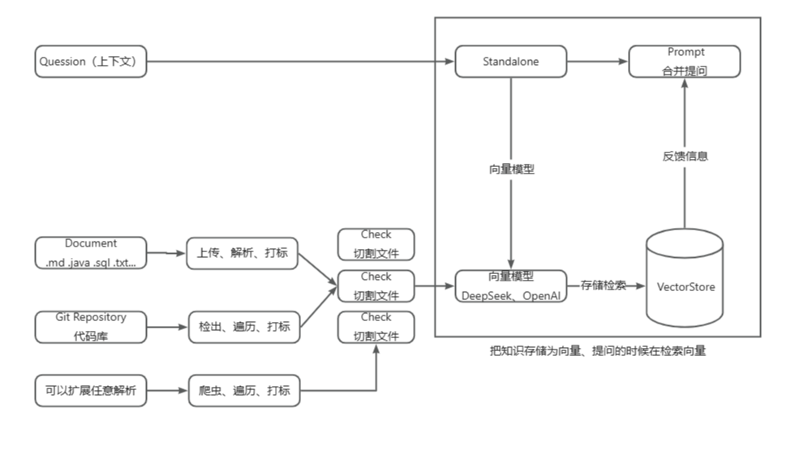
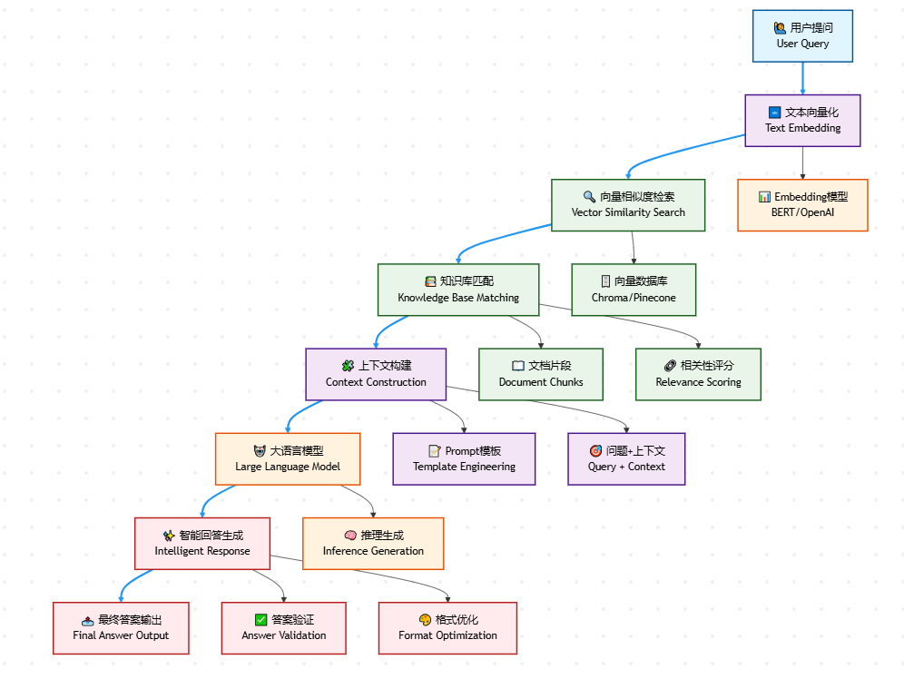

# 🚀 AI知识库检索系统

**中文版** | [English](README.md)

> 基于 Spring AI 框架构建的增强型 RAG（检索增强生成）智能知识库系统，集成 Ollama 和 OpenAI 模型

## 📖 项目简介

本项目是一个集成了检索增强生成（RAG）技术的智能知识库系统，旨在为企业提供全方位的AI辅助解决方案。通过结合多种大语言模型的能力，实现了从文档解析到智能问答的端到端智能化处理。

## ✨ 核心特性

### 🔍 RAG（检索增强生成）

**功能亮点：**
- 📄 **多格式文档处理**：通过 Apache Tika 支持 PDF、Word、Markdown 等多种文档格式
- 🔗 **Git代码库集成**：使用 JGit 自动拉取和解析代码仓库
- 🧠 **双重嵌入模型**：
  - 本地 `nomic-embed-text` 模型（通过 Ollama）保护隐私并控制成本
  - OpenAI `text-embedding-ada-002` 提供高质量嵌入
- 🗄️ **向量存储**：PostgreSQL 配合 pgvector 扩展实现持久化向量存储
- 🔄 **灵活模型切换**：基于配置的本地和云端模型切换

**技术优势：**
- 通过语义理解提升搜索准确性
- 成本效益的混合模型方案
- 可扩展的向量存储解决方案
- 隐私保护的本地处理选项

### 🤖 AI驱动的问答系统

**核心工作流程：**
1. **文档摄取**：使用 Spring AI Tika 集成解析和分块文档
2. **向量嵌入**：使用选定的嵌入模型将文本转换为向量
3. **语义搜索**：从向量数据库检索相关文档
4. **答案生成**：使用 OpenAI GPT 模型生成上下文相关的回答

**应用场景：**
- 企业知识管理
- 技术文档问答
- 代码仓库分析和搜索
- 智能客户支持

## 🏗️ 技术架构

### 支持的AI模型
- **Ollama 模型**：本地部署，使用 `nomic-embed-text` 进行嵌入
- **OpenAI GPT 系列**：云端模型用于文本生成和嵌入
- **可扩展框架**：轻松集成其他模型提供商

### 核心技术栈
- **后端框架**：Spring Boot 3.2.3 配合 Spring AI
- **向量数据库**：PostgreSQL 配合 pgvector 扩展
- **缓存**：Redis 用于性能优化
- **文档处理**：Apache Tika 支持多格式
- **API文档**：Swagger UI 配合 Knife4j 增强
- **容器化**：Docker 支持便于部署

### 关键依赖
- Spring AI BOM 用于AI模型集成
- Redisson 用于 Redis 操作
- JGit 用于 Git 仓库处理
- FastJSON 用于 JSON 处理
- HikariCP 用于数据库连接池

## 🚀 快速开始

### 前置要求
- Java 17+
- PostgreSQL 配合 pgvector 扩展
- Redis 服务器
- Ollama（用于本地模型）
- OpenAI API 密钥（用于云端模型）

### 配置

1. **数据库设置**：在 `application-dev.yml` 中配置 PostgreSQL 连接
2. **AI模型**：本地设置 Ollama 或配置 OpenAI API 凭据
3. **向量存储**：选择 SimpleVectorStore（内存）或 PgVectorStore（持久化）
4. **嵌入模型**：配置 `spring.ai.rag.embed` 选择嵌入模型

### 运行应用

```bash
# 克隆仓库
git clone <repository-url>

# 进入项目目录
cd ai-knowledge

# 使用 Maven 运行
mvn spring-boot:run -pl dev-tech-app
```

应用将在 8090 端口启动，Swagger UI 可通过 `/swagger-ui.html` 访问。

## 📊 系统架构图



## 📊 RAG流程图



## 🔧 配置选项

### 嵌入模型选择
- **本地模型**：设置 `spring.ai.rag.embed=nomic-embed-text` 保护隐私并节省成本
- **云端模型**：设置 `spring.ai.rag.embed=text-embedding-ada-002` 获得更高质量

### 向量存储选项
- **内存存储**：`SimpleVectorStore` 用于开发和测试
- **持久化存储**：`PgVectorStore` 用于生产环境

## 🤝 贡献

我们欢迎贡献！请随时提交问题和拉取请求。

## 📄 许可证

本项目采用 MIT 许可证 - 详情请参阅 LICENSE 文件。